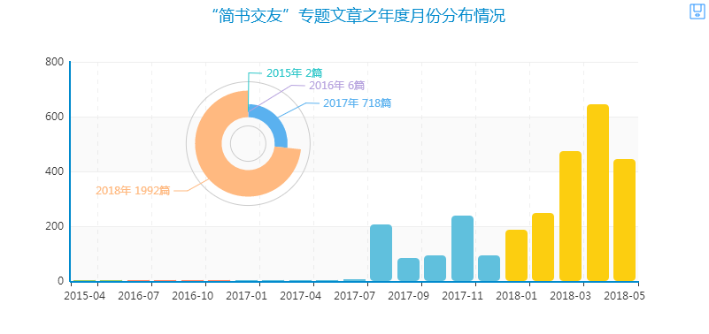
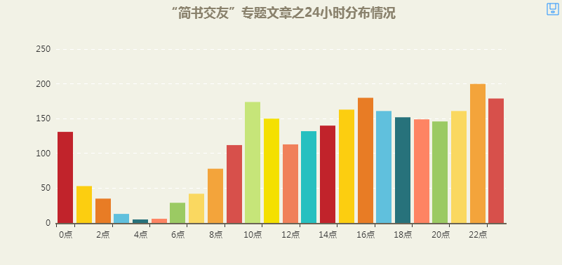
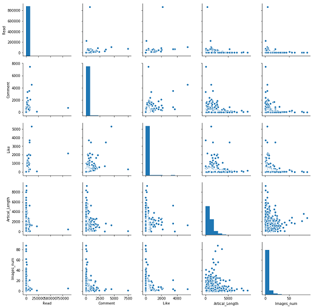

# 简书交友
## 系列文章
[乱炖数据之2700余篇“简书交友”专题文章数据的花式玩法](https://zhuanlan.zhihu.com/p/37618589)   
[乱炖“简书交友”数据之代码（1）](https://zhuanlan.zhihu.com/p/38058243)   
[乱炖“简书交友”数据之代码（2）：关键词抽取、Word2Vec词向量](https://zhuanlan.zhihu.com/p/38162556)   

### 文章年度月份分布情况

### 文章24小时分布情况

### 文章内容词云

### 文章长度与配图数之间的关系

### 阅读量、点赞数、评论数、文章篇幅与配图数之间的关系

### Word2Vec t-SNE 2维

### Word2Vec t-SNE 3维

### 人脸识别、颜值检测与图像拼接

### 图像特征提取与 t-SNE 可视化高维数据

## 打赏激励
### 微信赞赏码

### 微信赞赏码

